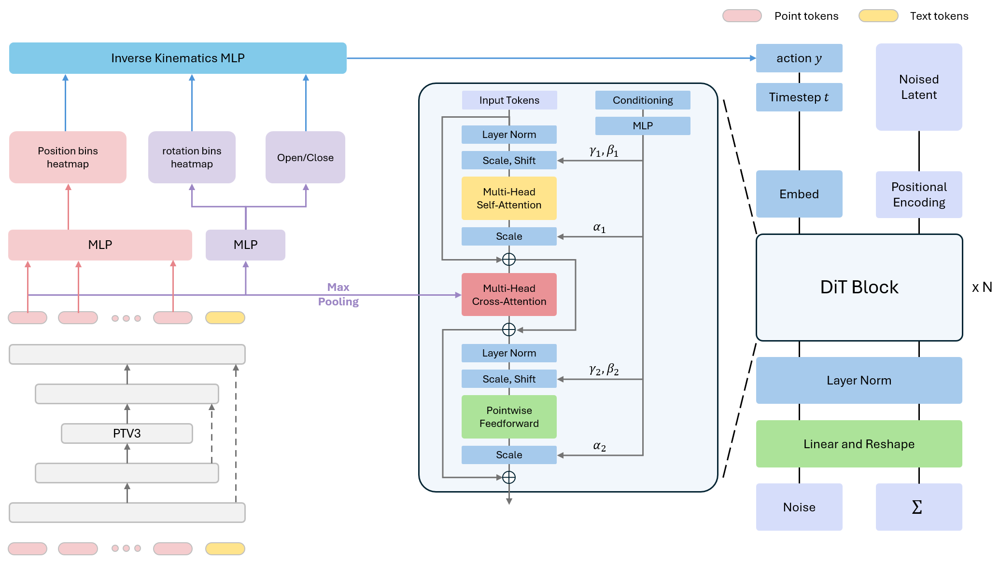

<div align="center">
  <h2>3DiTraj: 3D point cloud DiT Trajectory</h2>
  <h4>
    <a href="http://badajhong.github.io/">Haechan Chong*</a>,
  </h4>
  <h4>ICRA 2026 Targeting!</h4>

  <!-- Badges -->
  <p>
    <a href="https://www.di.ens.fr/willow/research/gembench/">
      
    </a>
  </p>

</div>


## Overview
Architecture of the 3DiTraj



## Installation
See [INSTALL.md](INSTALL.md) for detailed instructions in installation.

## Dataset

You can follow the instructions [here](DATAGEN.md) to generate the training data on your own, or download our generated dataset.

The dataset can be found in [Hugging Face](https://huggingface.co/datasets/rjgpinel/GEMBench).
Put the dataset in the `data/gembench` folder.
Dataset structure is as follows:
```
- data
    - gembench
        - train_dataset
            - microsteps: 567M, initial configurations for each episode
            - keysteps_bbox: 160G, extracted keysteps data
            - keysteps_bbox_pcd: (used to train 3D-LOTUS)
                - voxel1cm: 10G, processed point clouds
                - instr_embeds_clip.npy: instructions encoded by CLIP text encoder
            - motion_keysteps_bbox_pcd: (used to train 3D-LOTUS++ motion planner)
                - voxel1cm: 2.8G, processed point clouds
                - action_embeds_clip.npy: action names encoded by CLIP text encoder
        - val_dataset
            - microsteps: 110M, initial configurations for each episode
            - keysteps_bbox_pcd:
                - voxel1cm: 941M, processed point clouds
        - test_dataset
            - microsteps: 2.2G, initial configurations for each episode
```

The RLBench-18task dataset (peract) can be downloaded [here](https://huggingface.co/datasets/rjgpinel/RLBench-18Task/tree/main), following the same dataset structure as gembench.


## 3DiTraj

### Training
Train the 3DiTraj end-to-end on the GemBench train split. It takes about 14h with a single A6000 GPU.
```bash
bash job_scripts/train_dit_policy.sh
```

The trained checkpoints are available [here](https://huggingface.co/rjgpinel/3dlotus/tree/main/GEMBench/v1). You should put them in the folder `data/experiments/gembench/3dlotus/v1`.

### Evaluation
```bash
# both validation and test splits
To be continue ...
# bash job_scripts/eval_3dlotus_policy.sh
```

The evaluation script evaluates the 3DiTraj on the validation (seed100) and test splits of the GemBench benchmark.
The evaluation script skips any task that has already been evaluated before and whose results are already saved in `data/experiments/gembench/3dlotus/v1/preds/` so make  sure to clean it if you want to re-evaluate a task that you already evaluated.

We use the validation set to select the best checkpoint. The following script summarizes results on the validation split.
```bash
python scripts/summarize_val_results.py data/experiments/gembench/3dlotus/v1/preds/seed100/results.jsonl
```

The following script summarizes results on the test splits of four generalization levels:
```bash
python scripts/summarize_tst_results.py data/experiments/gembench/3dlotus/v1/preds 150000
```


